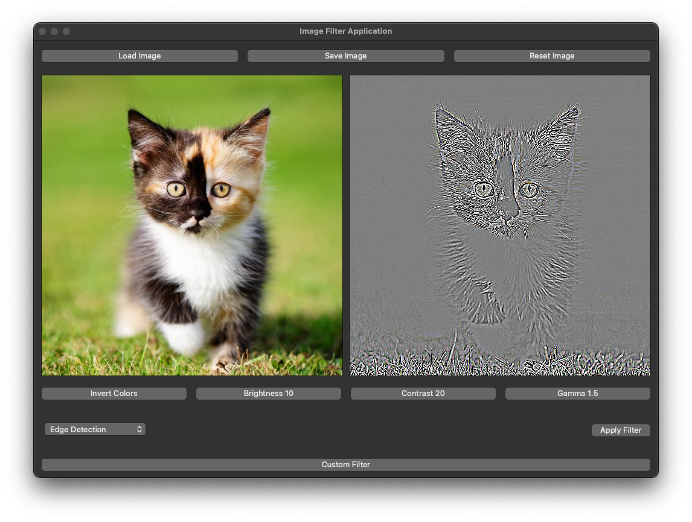
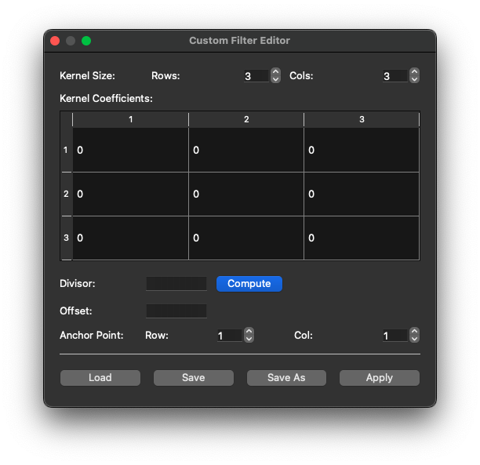

# Image Filter Application

## Overview

The **Image Filter Application** is a desktop application built using Qt that allows users to apply various image processing filters to images. The application supports a wide range of filters, including convolution-based filters (e.g., blur, sharpen, edge detection), functional filters (e.g., brightness, contrast, gamma correction), and custom filters defined by the user. The application provides an intuitive graphical user interface (GUI) for loading, editing, and saving images.

---

## Features

### 1. **Image Loading and Saving**
- Load images in common formats such as `.png`, `.jpg`, and `.bmp`.
- Save the processed images back to disk in the same formats.

### 2. **Functional Filters**
- **Invert Colors**: Inverts the colors of the image.
- **Brightness Adjustment**: Adjusts the brightness of the image.
- **Contrast Adjustment**: Adjusts the contrast of the image.
- **Gamma Correction**: Applies gamma correction to the image.

### 3. **Convolution Filters**
- **Blur**: Smoothens the image by applying a blur kernel.
- **Gaussian Blur**: Applies a Gaussian blur for a more natural smoothing effect.
- **Sharpen**: Enhances the edges in the image.
- **Edge Detection**: Detects edges in the image using a predefined kernel.
- **Emboss**: Creates an embossed effect on the image.

### 4. **Custom Filters**
- Open a **Custom Filter Editor** to define and apply custom convolution filters.
- Specify kernel size, coefficients, divisor, offset, and anchor points.
- Save and load custom filters for reuse.

### 5. **Advanced Filters**
- **Median Filter**: Reduces noise by replacing each pixel with the median value of its neighborhood.
- **Ordered Dithering**: Applies dithering using a threshold map.
- **Uniform Quantization**: Reduces the number of colors in the image by quantizing the RGB channels.

### 6. **Real-Time Preview**
- View the original and filtered images side-by-side in scrollable areas.
- Adjust filter parameters and immediately see the results.

---

## Installation

### Prerequisites
- **Qt Framework**: Ensure you have the Qt framework installed on your system. This project uses Qt 6.
- **C++ Compiler**: A C++17-compatible compiler is required.
- **CMake or QMake**: Use either CMake or QMake to build the project.

### Steps
1. Clone the repository:
   ```bash
   git clone <repository-url>
   cd filtering
   ```
2. Build the project:
   - Using QMake:
     ```bash
     qmake filtering.pro
     make
     ```
   - Using CMake:
     ```bash
     mkdir build
     cd build
     cmake ..
     make
     ```
3. Run the application:
   ```bash
   ./filtering.app/Contents/MacOS/filtering
   ```

---

## Usage

### 1. **Loading an Image**
- Click the **"Load Image"** button to open a file dialog.
- Select an image file to load it into the application.

### 2. **Applying Filters**
- Use the buttons in the **Functional Filters** section to apply filters like brightness, contrast, and gamma correction.
- Use the **Convolution Filters** dropdown to select a filter and click **"Apply Filter"** to apply it.
- For advanced filters like median filtering, dithering, or quantization, configure the parameters in the respective sections before applying.

### 3. **Custom Filters**
- Click the **"Custom Filter"** button to open the filter editor.
- Define the kernel size, coefficients, divisor, offset, and anchor points.
- Apply the custom filter to the image.

### 4. **Saving an Image**
- Click the **"Save Image"** button to save the processed image to disk.

### 5. **Resetting the Image**
- Click the **"Reset Image"** button to revert to the original loaded image.

---

## GUI Layout

1. **Top Row**: Buttons for loading, saving, and resetting the image.
2. **Image Display**: Side-by-side view of the original and filtered images.
3. **Functional Filters**: Buttons for applying functional filters.
4. **Convolution Filters**: Dropdown for selecting convolution filters and applying them.
5. **Advanced Filters**: Configurable sections for median filtering, dithering, and quantization.
6. **Custom Filter Editor**: Button to open the custom filter editor.

---

## Screenshots

### Main Window


### Custom Filter Editor


---

## Code Structure

### Key Files
- **`mainwindow.cpp`**: Implements the main application logic and GUI.
- **`filtereditordialog.cpp`**: Implements the custom filter editor dialog.
- **`imageprocessor.h`**: Contains static methods for applying various filters.
- **`kernel.h`**: Defines the `Kernel` class for convolution operations.

### Directory Structure
```
filtering/
├── assets/          # Predefined filter files and photos
├── include/         # Header files
├── src/             # Source files
├── main.cpp         # Entry point
├── filtering.pro    # QMake project file
└── Makefile         # Build file
```

---

## Acknowledgments

- Built using the **Qt Framework**.
- Inspired by common image processing techniques.

